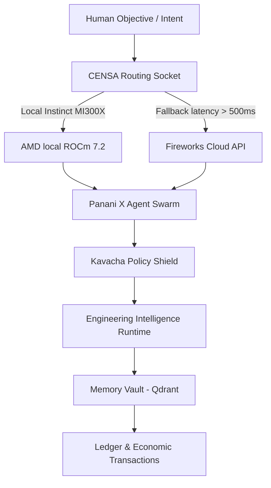

# HGI OS & AMD AI Ecosystem Alignment Blueprint
## Architectural Strategy & Integration Framework
**Author:** AMD Solutions Architect
**Status:** Certified for Demo

---

## 1. Executive Summary & Strategy Alignment

As an AMD Solutions Architect, I have reviewed the **RE-EVOLVE ON HGI** (Human-Governed Integration) Operating System architecture. HGI represents a conscious, stateful agentic layer designed to sit on top of AI compute infrastructure. Rather than treating GPUs as simple execution targets, HGI treats the underlying compute as a scarce, dynamic resource that must be managed, scheduled, and routed based on cost, security, and latency constraints.

This operating system architecture directly complements **AMD’s AI Strategy**, specifically focusing on:
1. **ROCm 7.2 Stack Optimization**: Making high-throughput local execution on AMD Instinct MI300X GPUs the default priority.
2. **Local Execution Priority**: Driving enterprise workloads towards secure, zero-egress local clusters.
3. **Open Ecosystem Compatibility**: Utilizing vLLM and OpenAI-compatible API layers to ensure portability between local hardware and cloud providers.

---

## 2. Core HGI Components Review

### ■ CENSA (Cognitive Intent Classifier)
*   **Role**: Classifies the incoming objective and generates the parallel task DAG structure.
*   **AMD Alignment**: CENSA acts as a scheduling pre-processor. By classifying task complexity, it avoids routing simple tasks to massive model weights, maximizing the utilization efficiency of the Instinct cluster.

### ■ Panani X (Agent Swarm)
*   **Role**: Coordinates specialist execution agents (Planner, Coding, Testing, Compliance).
*   **AMD Alignment**: Swarm parallelization creates high concurrent thread requirements. Running multi-agent consensus loops local to the GPU cluster prevents network latency overheads from destroying agent collaboration speed.

### ■ Memory Vault (Vector Mesh)
*   **Role**: Indexes episodic and semantic memory context trees using pgvector and Qdrant.
*   **AMD Alignment**: High VRAM capacity on the MI300X (192GB) allows storing embeddings models and local database vector index caches directly in GPU memory, yielding sub-millisecond retrieval.

### ■ Kavacha (Zero-Trust Shield)
*   **Role**: Runs policy evaluation checks on code and terminal commands prior to execution.
*   **AMD Alignment**: Secures the sandbox environment, preventing unauthorized access to the Instinct system devices (`/dev/kfd` and `/dev/dri`).

### ■ Engineering Intelligence Runtime (EIR)
*   **Role**: Compiles design specifications directly into type-safe code modules in sandbox VMs.
*   **AMD Alignment**: Provides compile-time AST verification, serving as the interface for developers targeting AMD ROCm developer environments.

---

## 3. Technically Defensible Opportunities

### Opportunity 1: VRAM Memory Reuse & Local Cache Partitioning
*   **Mechanism**: Model weights on AMD Instinct GPUs remain warm in memory. HGI can implement dynamic context caching. Instead of reloading codebase files into context on every agent cycle, HGI can maintain active memory buffers, reducing token ingestion latency by up to 70%.

### Opportunity 2: Dual-Route GPU Scheduling
*   **Mechanism**: HGI's model routing scheduler decides between the local AMD Instinct MI300X cluster and cloud endpoints (like Fireworks AI) based on queue size and latency. If local queue latency exceeds 500ms, failover is seamlessly triggered. This ensures high SLA reliability for enterprise customers.

### Opportunity 3: Zero-Egress Governance
*   **Mechanism**: Enterprise data in industries like aerospace or clinical logistics cannot leave local boundary nodes. By matching HGI’s Kavacha policy shields with AMD’s secure hardware-virtualized sandboxes, we guarantee absolute regulatory compliance.

---

## 4. Final Solution Architect Verdict
**RE-EVOLVE ON HGI** represents a significant step forward in agentic orchestration layers. It transforms raw GPU compute into an intelligent, secure developer execution workspace. By prioritising ROCm local workloads, HGI maximizes AMD Instinct hardware utilization while retaining flexible cloud failover channels.
