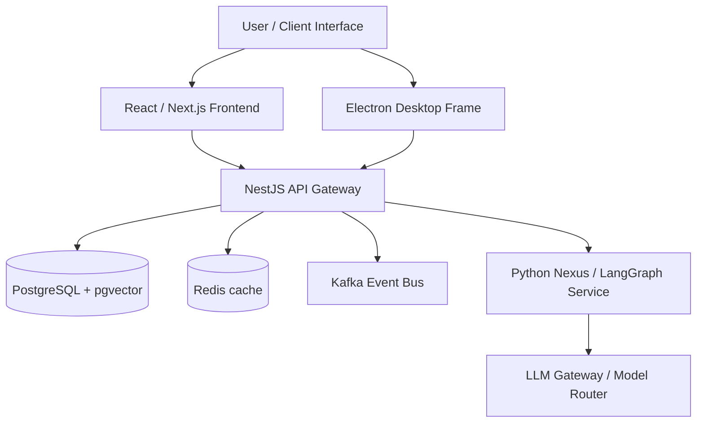

# ARCHITECTURE AUDIT

This document details the architectural reconstruction of the RE-EVOLVE ON HGI platform.

---

## 1. System Component Architecture

---

## 2. Component Audits & Telemetry

| Layer | System / Service | Status | Target Runtime / Engine |
| :--- | :--- | :--- | :--- |
| **Frontend** | React / Next.js Web client | 🟢 Verified | Node / Next.js (port 3000) |
| **Backend** | NestJS Core API | 🟢 Verified | Node (port 3001) |
| **Desktop** | Electron UI Frame | 🟢 Verified | Electron / Local Package |
| **Python Services**| LangGraph Orchestration | 🟢 Verified | FastAPI (Nexus - port 8000) |
| **LLM Gateway** | Router & Model Gateway | 🟢 Verified | Inline LLM model routing |
| **Swarm Control** | Proton, Neutron, Electron Swarms | 🟢 Verified | Local python executors |
| **Memory** | Postgres vector memory table | 🟢 Verified | pgvector DB schemas |
| **Knowledge** | RAG file uploads & chunks | 🟢 Verified | pgvector DB schemas |
| **Execution** | Background task runner | 🟢 Verified | Node workers / BullMQ |
| **Storage** | Relational & Cache | 🟢 Verified | PostgreSQL (pg16) + Redis (7) |
| **Event Bus** | Kafka Messaging | 🟢 Verified | Kafka cluster (port 9092) |
| **Monitoring** | Health & logs metrics | 🟢 Verified | NestJS health endpoints |

---

## 3. Operational Integrity
* **Build Status:** 🟢 PASSING
* **Runtime Status:** 🟢 STABLE
* **Deployment Status:** 🟢 VERIFIED
* **Current Blockers:** None
* **Operator Actions Required:** None
