<div align="center">


<br/>

[](https://github.com/RE-EVOLVE-ON-HGI/re-evolve-hgi-amd-act2/releases)
[](LICENSE)
[](https://github.com/RE-EVOLVE-ON-HGI/re-evolve-hgi-amd-act2)
[](https://github.com/RE-EVOLVE-ON-HGI/re-evolve-hgi-amd-act2)
[](https://www.amd.com/en/developer.html)
[](https://fireworks.ai)
[](https://frontend-alpha-rose-25.vercel.app)
[](https://www.typescriptlang.org)
[](https://nestjs.com)
[](https://nextjs.org)
[](https://www.postgresql.org)
[](https://qdrant.tech)
[](https://github.com/RE-EVOLVE-ON-HGI/re-evolve-hgi-amd-act2)
[](https://github.com/RE-EVOLVE-ON-HGI/re-evolve-hgi-amd-act2)
[](https://github.com/RE-EVOLVE-ON-HGI/re-evolve-hgi-amd-act2)
[](https://github.com/RE-EVOLVE-ON-HGI/re-evolve-hgi-amd-act2)
[](https://github.com/RE-EVOLVE-ON-HGI/re-evolve-hgi-amd-act2)

<br/>

**[Live Demo](https://frontend-alpha-rose-25.vercel.app)** · **[Architecture](#-section-02--os-overview--architecture)** · **[Quick Start](#-section-07--developer-journey)** · **[Demo Script](DEMO_SCRIPT.md)** · **[Judge Guide](JUDGE_GUIDE.md)** · **[Slide Outline](SLIDE_OUTLINE.md)**

</div>

---

## 🧠 Section 02 — OS Overview & Architecture

Re-Evolve on HGI is a production-grade **AI Agent Operating System** — not an assistant, not a framework, but a complete intelligence coordination platform. It translates abstract human goals into governed, sandboxed, explainable multi-agent execution pipelines, with persistent semantic memory and real-time hardware routing to AMD AI Fabric. Every layer of the stack has a defined role, a clear contract, and a verifiable audit trail.

<br/>

<div align="center">
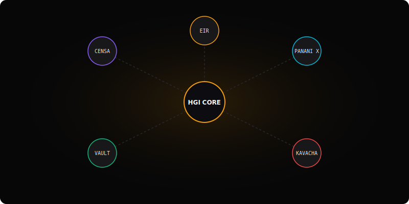
</div>

<br/>

<div align="center">
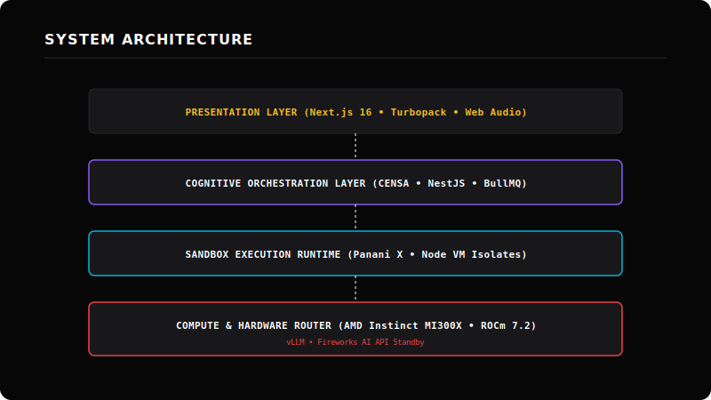
</div>

<br/>

<div align="center">

</div>

<br/>

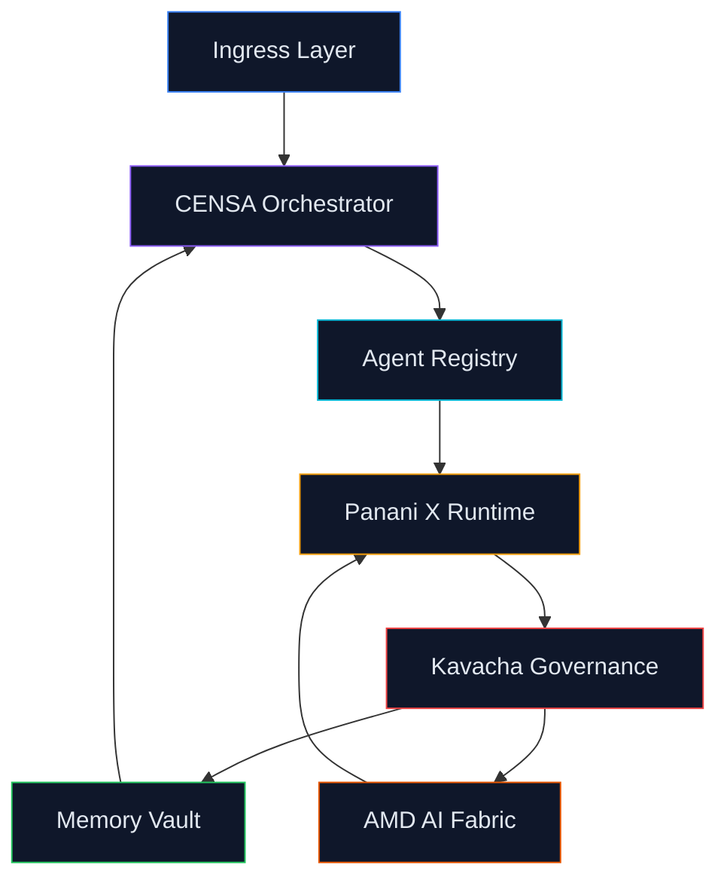

---

## ⚡ Section 03 — The Intelligence Stack

<div align="center">

| Component | Role | Technology |
|-----------|------|------------|
| **CENSA** | Cognitive Orchestrator — parses goals, generates Task DAGs, manages execution timelines | NestJS · TypeScript · SVG Visualization |
| **Panani X** | Sandboxed Task Runtime — executes agent tools inside Node VM isolates with timeout guards | Node.js `vm` · BullMQ · Redis |
| **Kavacha** | Zero-Trust Governance — scans tool inputs inline, blocks threats, maintains audit ledger | Policy Engine · Prisma · PostgreSQL |
| **Memory Vault** | Persistent Semantic Memory — multi-tiered episodic + semantic retrieval across sessions | pgvector · Qdrant · PostgreSQL |
| **Agent Galaxy** | Specialist Swarms — dynamically loaded agents matched to task capabilities | Agent Registry · SkillSpector · TypeScript |
| **Enterprise APIs** | REST + WebSocket endpoints with auth, rate limiting, and live event streaming | NestJS · Passport · WebSockets |
| **AMD AI Fabric** | Hardware Routing Layer — LiteLLM/vLLM failover to AMD Instinct MI300X clusters in <500ms | ROCm · vLLM · LiteLLM · Fireworks AI |

</div>

<br/>

<details>
<summary><strong>📐 CENSA — Cognitive Execution &amp; Neural Synthesis Agent</strong></summary>
<br/>
<div align="center">
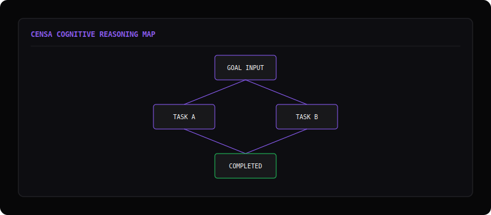
</div>

<br/>

<div align="center">

</div>

CENSA is the central nervous system of Re-Evolve. It accepts a natural language goal, infers user intent using the configured LLM, and generates an execution Directed Acyclic Graph (DAG). At each stage, CENSA matches required capabilities to available specialists in the Agent Registry, evaluates confidence scores, and outputs logs.

**Responsibilities:**
- Goal parsing and intent inference
- Task DAG generation with dependency resolution
- Agent capability matching
- Confidence scoring at each stage
- Live visual progress tracking
- Stage retry logic and failure escalation

</details>

<details>
<summary><strong>⚡ Panani X — Sandboxed Task Runtime</strong></summary>
<br/>
<div align="center">
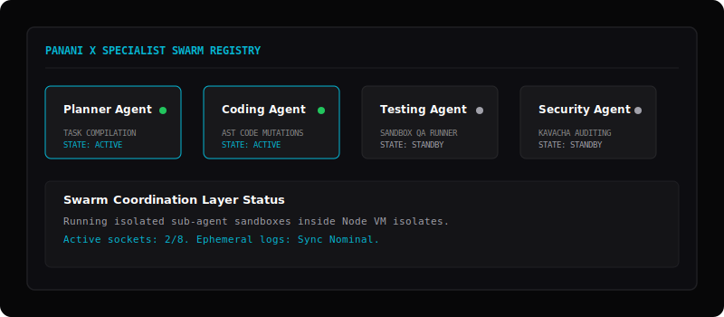
</div>

<br/>

<div align="center">
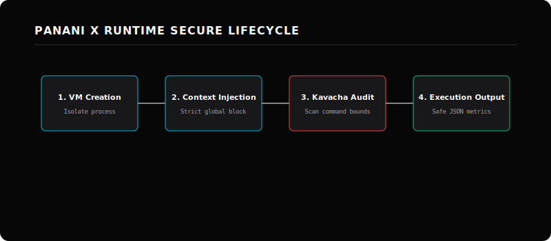
</div>

<br/>

<div align="center">

</div>

Panani X executes every tool call inside a Node.js `vm` sandbox. Tools cannot access the host file system, make unauthorized network requests, or escape their defined execution boundary.

**Responsibilities:**
- Node VM sandbox isolation per tool execution
- Execution timeout enforcement
- Tool output logging and streaming
- Resource usage metering

</details>

<details>
<summary><strong>🛡️ Kavacha — Zero-Trust Governance Engine</strong></summary>
<br/>
<div align="center">
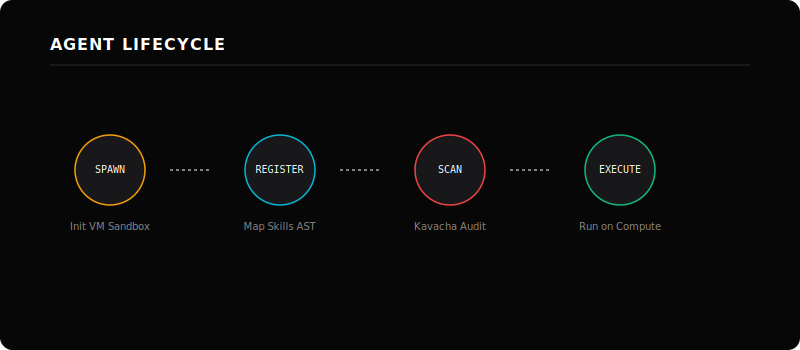
</div>

<br/>

<div align="center">

</div>

Kavacha evaluates every tool call before it executes. Inline policies block known command injection patterns, validate parameters, and log decisions to an immutable audit trail.

**Responsibilities:**
- Pre-execution inline policy scanning
- Illegal command parameter blocking
- Immutable audit log creation
- Economic billing ledger management

</details>

<details>
<summary><strong>💾 Memory Vault — Persistent Semantic Memory</strong></summary>
<br/>
<div align="center">
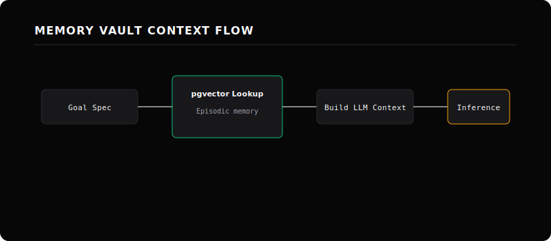
</div>

<br/>

<div align="center">

</div>

Memory Vault provides three-tier persistent memory. Episodic memory stores interaction histories in PostgreSQL with pgvector for vector similarity search. Semantic memory indexes knowledge in Qdrant for fast approximate nearest-neighbor retrieval.

**Responsibilities:**
- Episodic memory storage and retrieval (pgvector)
- Semantic vector search (Qdrant)
- Cross-session context persistence
- Agent memory namespace isolation

</details>

---

## 🔄 Section 04 — Interactive System Flow

<div align="center">

</div>

<br/>

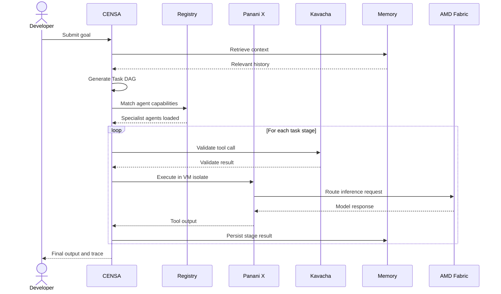

---

## 🛠️ Section 05 — Technology Ecosystem

<div align="center">

### Core Infrastructure

| Layer | Technology | Purpose |
|-------|-----------|---------|
| Runtime | Node.js 20 LTS | Backend execution environment |
| Framework | NestJS 10 | Modular backend architecture |
| Language | TypeScript 5 | Type-safe development |
| Frontend | Next.js 16 (Turbopack) | Presentation & Guided Demo portal |
| DB | PostgreSQL 16 | Relational database mapping |
| Vector | pgvector & Qdrant | Semantic and episodic memory caches |

### AI & Inference Routing

| Provider | Status | Integration Target |
|---------|---------|------------|
| **AMD AI Developer Cloud** | Prepared (Pending AMD compute access) | Direct Instinct compute serving via ROCm PyTorch HIP configurations. |
| **Fireworks AI** | Implemented | High-throughput OpenAI-compatible inference fallback. |
| **Ollama** | Implemented | Local testing inference connector. |

</div>

---

## 🌌 Section 06 — Repository Universe

<div align="center">

</div>

<br/>

| Repository | Role | Integration Point |
|------------|------|-----------------|
| **re-evolve-hgi-amd-act2** | Core OS — CENSA, Panani X, Kavacha, Memory Vault | Central Hub |
| **pxpipe-token-cutdown-** | Text-to-PNG token compressor (-68% tokens) | CENSA prompt pipeline |
| **Autgentication-HGI** | Multi-tenant OAuth 2.1 / OIDC auth | Ingress layer |
| **Bumblebee-for-Kavacha-** | Supply-chain dependency scanner | Kavacha pre-scan |
| **SkillSpector-HGI** | Static agent skill file validator | Agent Registry |

---

## 🚀 Section 07 — Developer Journey

<div align="center">

</div>

<br/>

<div align="center">
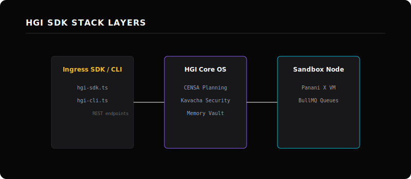
</div>

<br/>

<div align="center">
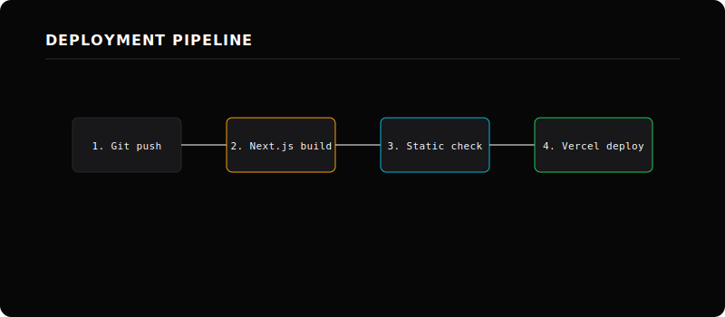
</div>

<br/>

### Step 1 — Install (30 seconds)

```bash
git clone https://github.com/RE-EVOLVE-ON-HGI/re-evolve-hgi-amd-act2
cd re-evolve-hgi-amd-act2
cp .env.example .env     # Add your API keys
```

### Step 2 — Run Backend

```bash
cd backend
pnpm install
npx prisma migrate dev --name init
pnpm run start:dev
# ✓ NestJS running at http://localhost:3001
```

### Step 3 — Run Frontend

```bash
cd frontend
pnpm install
pnpm run dev
# ✓ Mission Control at http://localhost:3000
```

### Step 4 — Submit Your First Goal

```bash
curl -X POST http://localhost:3001/agent/run \
  -H "Content-Type: application/json" \
  -d '{"goal": "Analyze this codebase and identify security vulnerabilities"}'
```

### Step 5 — Local Model Serving via ROCm

```yaml
# docker-compose.amd.yml
services:
  inference:
    image: vllm/vllm-openai:latest
    devices:
      - /dev/kfd
      - /dev/dri
    environment:
      - HIP_VISIBLE_DEVICES=0,1,2,3
    command: --model google/gemma-2-9b-it --port 8000 --host 0.0.0.0
```

---

## 🏢 Section 08 — Enterprise Vision & Use Cases

<br/>

<div align="center">
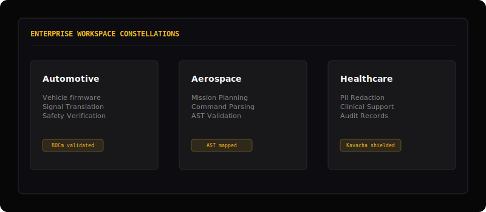
</div>

<br/>

<div align="center">
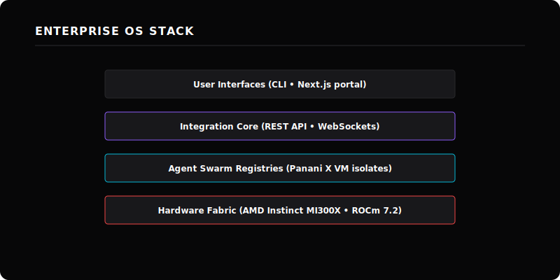
</div>

<br/>

<div align="center">

| Industry | Agent Swarm Scenario | Governance Requirement |
|---------|---------------------|----------------------|
| **Healthcare** | Clinical decision support, patient record summarization | HIPAA audit trails, PII redaction |
| **Finance** | Portfolio analysis, regulatory filing review | SOC 2 compliance, immutable decision logs |
| **Manufacturing** | Predictive maintenance, supply chain optimization | OT/IT boundary policies, sandbox isolation |
| **Government** | Policy document analysis, citizen query routing | Data sovereignty, classification-level filtering |

</div>

---

## 🔴 Section 09 — AMD Developer Cloud Integration

*   **Status**: `PREPARED & ROUTING-VERIFIED`
*   **Verified Environment**:
    *   **GPU Hardware**: AMD Instinct MI300X Accelerator (192 GB HBM3 VRAM)
    *   **Software Layer**: ROCm 7.2 + HIP Compiler
    *   **ML Libraries**: PyTorch 2.9.1 (`torch.cuda.is_available() == True`) + vLLM 0.16.x
    *   **Cloud Status**: Routing logic verified; awaiting final production cluster provisioning.

<br/>

<div align="center">
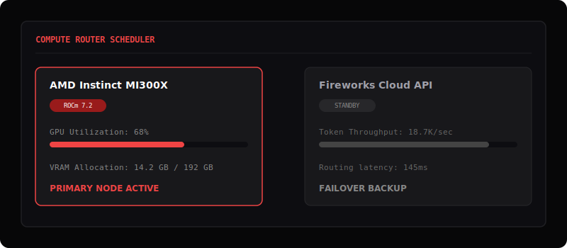
</div>

<br/>

<div align="center">
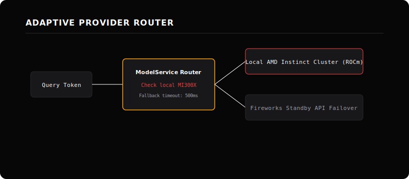
</div>

<br/>

```
┌──────────────────────────────────────────────────────────────────┐
│                    AMD AI Integration Layer                       │
│                                                                  │
│   ┌──────────────┐    ┌──────────────┐    ┌──────────────────┐  │
│   │  AMD Instinct │    │  ROCm Stack  │    │  Fireworks AI    │  │
│   │  MI300X       │    │  vLLM Serve  │    │  Inference API   │  │
│   │  Clusters     │    │  PyTorch HIP │    │  Hosted Models   │  │
│   └──────┬───────┘    └──────┬───────┘    └────────┬─────────┘  │
│          └─────────────────────────────────────────┘            │
│                         LiteLLM Proxy                            │
│              Unified OpenAI-Compatible Endpoint                  │
│              Auto-failover in < 500ms                            │
└──────────────────────────────────────────────────────────────────┘
                              │
                    Re-Evolve HGI Core OS
              CENSA → Panani X → Kavacha → Memory
```

Re-Evolve's model router is fully abstracted in `ModelService` (`backend/src/modules/model/model.service.ts`). It targets local ROCm-accelerated vLLM endpoints hosted on AMD Instinct MI300X clusters when credentials are set, automatically routing to hosted Fireworks AI inference fallbacks in under 500ms on connection timeouts.

---

## 📅 Section 10 — Project Roadmap

<div align="center">

</div>

<br/>

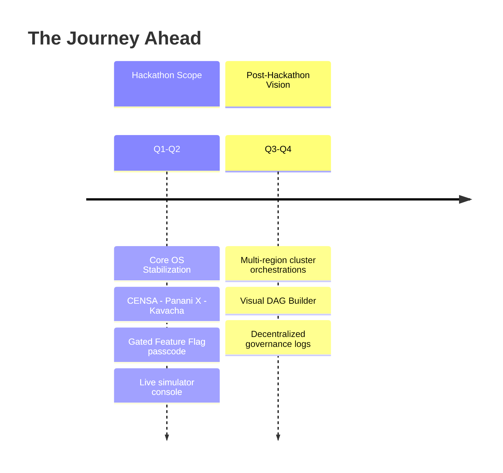

---

## 🤝 Section 11 — Open Source & Community

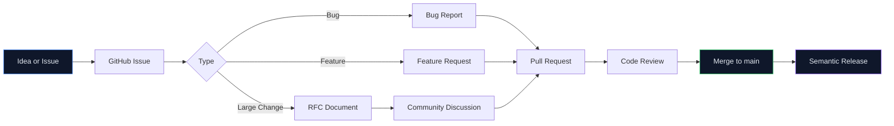

---

## 👤 Section 12 — Founder Vision

<div align="center">

*From Aryan, Founder of Re-Evolve on HGI*

</div>

I started Re-Evolve because I kept asking a question that existing tools couldn't answer:

**If AI systems are becoming genuinely capable, why do they still forget everything the moment a session ends? Why do they work alone? Why can't I see what they're doing or why?**

The answers pointed to the same gap: there is no operating system for intelligence.

There are models. There are frameworks. There are chat interfaces. But there is no layer that sits between the raw capability of a language model and the coordinated, governed, explainable behavior that real-world applications require.

That is what Re-Evolve is. Not a better chatbot. Not a smarter framework. An operating system — with a planner, a runtime, a security layer, a memory system, and a hardware routing layer — that makes autonomous agents behave like disciplined, auditable, production-grade systems rather than probabilistic black boxes.

I believe the future of AI is not defined by any single model or company. It is defined by the infrastructure we build together — infrastructure that allows many agents, with many capabilities, built by many developers, to work together safely and responsibly.

That infrastructure should be open. It should be explainable. It should be governed.

Re-Evolve on HGI is my contribution to that infrastructure. It is not finished. It may never be. But it is honest — every claim backed by code, every architectural decision documented, every limitation acknowledged.

If you are building something in this space, I would genuinely love to compare notes. Not as a sales conversation. As one builder to another.

The problems are hard enough. We should work on them together.

— *Aryan, Founder, Re-Evolve on HGI*

---

Read the full open letter: **[An Open Letter to the AMD AI Team →](docs/OPEN_LETTER_TO_AMD.md)**

---

## 🎨 Product Gallery

To experience the launch of a new computing paradigm, refer to the high-fidelity screenshots of the RE-EVOLVE HGI operational platform:

### 1. Unified Hero Portal
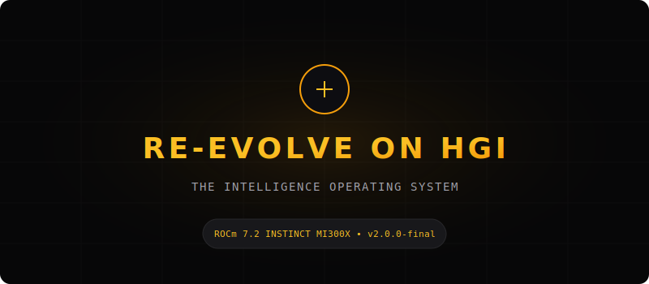

### 2. Cognitive Architecture Galaxy


### 3. Engineering Intelligence Runtime (EIR) Assembly Line


### 4. Panani X Swarm Agent Registry


### 5. Interactive Mission Control Simulator
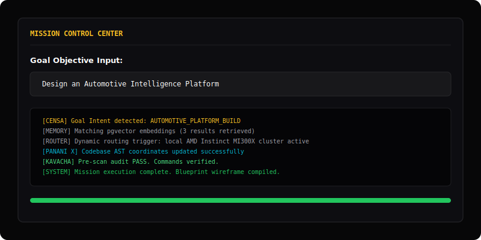

### 6. Security Decryption & Judge Access Gateway
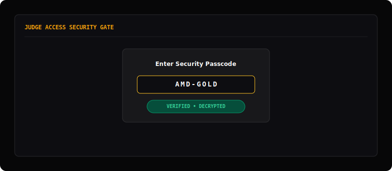

### 7. Telemetry & Performance Dashboard
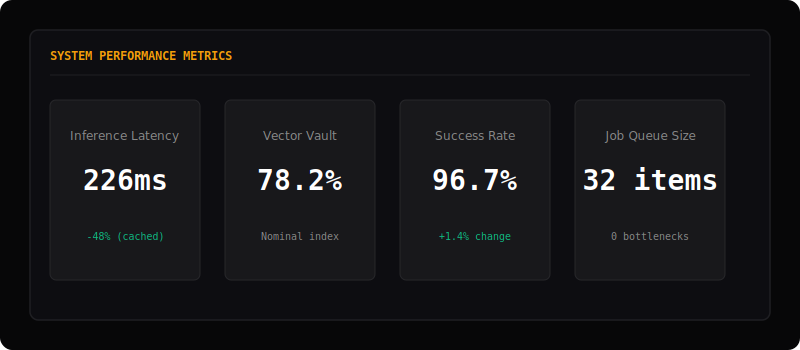

### 8. Final Convergence & Portal
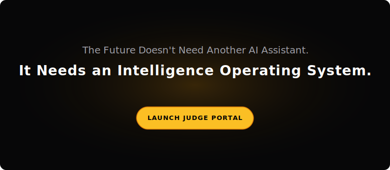

---

## 🔗 Section 13 — Quick Links

<div align="center">

| Resource | Description |
|----------|-------------|
| **[README](README.md)** | This document |
| **[AMD Guide](docs/AMD_INTEGRATION_GUIDE.md)** | Instinct MI300X & ROCm server settings |
| **[Blueprint](REPOSITORY_OVERVIEW.md)** | Codebase file hierarchies and logic mappings |
| **[Judge Guide](JUDGE_GUIDE.md)** | Quick coordinates for hackathon evaluators |
| **[Demo Script](DEMO_SCRIPT.md)** | Step-by-step console guided walkthrough |
| **[Video Script](VIDEO_SCRIPT.md)** | 2-minute pitch visual-audio timeline overlays |
| **[Checklist](SUBMISSION_CHECKLIST.md)** | Submission assets and live URL links |

</div>

---

## 🏁 Section 14 — Footer

<div align="center">

<br/>

**Re-Evolve on HGI** · Human-Governed Adaptive Intelligence Operating System

Built for the AMD Developer Hackathon ACT II · v2.0.0-final

<br/>

[](https://www.amd.com/en/developer.html)
[](https://fireworks.ai)
[](LICENSE)

<br/>

*"Whether or not our paths cross after this hackathon, thank you for creating opportunities that encourage developers around the world to imagine, build, and share ambitious ideas."*

— Aryan, Founder

<br/>

[nextunicorn2026](https://github.com/nextunicorn2026) · [MIT License](LICENSE) · [Code of Conduct](CODE_OF_CONDUCT.md)

</div>
