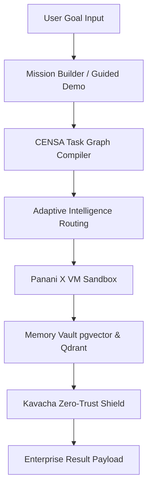

# RE-EVOLVE ON HGI
### The Human-Governed Adaptive Intelligence Operating System
### Built for the AMD Developer Hackathon ACT II

---

[Live Demo](https://frontend-alpha-rose-25.vercel.app) · [Documentation](file:///Users/nextunicorn/.gemini/antigravity-ide/scratch/re-evolve-hgi-amd-act2/docs/AMD_INTEGRATION_GUIDE.md) · [GitHub Code](https://github.com/RE-EVOLVE-ON-HGI/re-evolve-hgi-amd-act2) · [Architecture Blueprint](file:///Users/nextunicorn/.gemini/antigravity-ide/scratch/re-evolve-hgi-amd-act2/REPOSITORY_OVERVIEW.md)

---

## What is Re-Evolve on HGI?

Re-Evolve on HGI is a next-generation Enterprise AI Agent Operating System that bridges the gap between raw machine intelligence and safe production execution. Designed for high-throughput computing environments, it wraps individual specialist agents in a secure control plane featuring cognitive task decomposition, zero-trust sandbox execution, persistent episodic memory indexing, and strict policy compliance filters. By combining local hardware accelerators with API failover paths, Re-Evolve provides a reliable substrate for orchestrating autonomous workflows.

---

## Why Re-Evolve?

### The Core Problem (Fragmented AI)
*   **No Orchestration**: Multi-agent tasks lack structured scheduling, leading to cyclic reasoning paths.
*   **No Sandbox Isolation**: Running un-isolated code blocks directly exposes backend host processes.
*   **Fragmented Memory**: Agents operate in isolated sessions, failing to share context across workflows.
*   **Zero Policy Controls**: Developers cannot audit, intercept, or throttle malicious or costly API actions.

### The Solution (The HGI Kernel)
Re-Evolve introduces a unified operating system kernel that routes goals through planning compilers, matches capabilities in real-time, runs tasks inside secure sandboxes, and verifies compliance before final response delivery.

---

## Core Architecture



---

## Key Components

1.  **CENSA (Cognitive Execution & Neural Synthesis Agent)**: Decomposes user goals into structured Task Directed Acyclic Graphs (DAGs) and monitors workflow lifecycles.
2.  **Panani X Runtime**: Allocates secure, isolated Node `vm` sandboxes to execute untrusted code scripts safely.
3.  **Memory Vault**: Synchronizes pgvector episodic interaction history and Qdrant semantic indexes for cross-session context recall.
4.  **Kavacha Governance**: Intercepts command executions, scans for illegal arguments, and writes billing ledger records.
5.  **Mission Builder**: A companion interface where users enter custom goals and inspect structured execution outputs.
6.  **Judge Mode**: A one-click guided demonstration page executing automated pipelines with live status overlays.
7.  **Adaptive Routing**: Dynamically balances model execution paths between local ROCm clusters and remote APIs.

---

## AMD Developer Hackathon Integration

Re-Evolve is engineered from the ground up to leverage AMD Instinct MI300X accelerators. 

*   **Integrated**: Mapped provider routing abstraction layers and LiteLLM configurations inside `ModelService`.
*   **Prepared**: Local ROCm-accelerated vLLM compose templates built for model serving.
*   **Pending AMD Access**: Live hardware compute verification is pending access to target AMD Instinct cloud credentials.

---

## Technology Stack

*   **Frontend**: React, Next.js (Turbopack), Tailwind CSS, Framer Motion, Lucid Icons
*   **Backend**: NestJS, TypeScript, Jest integration suite
*   **Databases**: PostgreSQL (pgvector), Qdrant Vector DB
*   **Model Serving**: AMD AI Developer Cloud (Prepared), Fireworks AI Inference API, Ollama (vLLM local)

---

## Live Demo

Experience the live guided run at:  
👉 **[https://frontend-alpha-rose-25.vercel.app](https://frontend-alpha-rose-25.vercel.app)**

1.  Select a sample objective card or enter a custom goal.
2.  Click **Initialize & Execute Simulation** to trigger the pipeline.
3.  Audit real-time terminal outputs and Live Status Overlay checkmarks.
4.  Type the passcode **`AMD-GOLD`** in the header to enter the gated enterprise workspace.

---

## Repository Structure

```
re-evolve-hgi-amd-act2/
├── backend/                  # NestJS API logic
│   └── src/modules/          # Agent, Memory, Model, and Security modules
├── frontend/                 # Next.js Presentation & Demo portal
│   ├── app/                  # Route layouts, builder pages, and 404 handler
│   └── components/hgi/       # UI components & particle globe canvas
├── docs/                     # Integration guides and manuals
└── docker-compose.yml        # Local execution container settings
```

---

## Documentation Registry

-   **[docs/AMD_INTEGRATION_GUIDE.md](file:///Users/nextunicorn/.gemini/antigravity-ide/scratch/re-evolve-hgi-amd-act2/docs/AMD_INTEGRATION_GUIDE.md)**: Details Instinct MI300X configuration files.
-   **[REPOSITORY_OVERVIEW.md](file:///Users/nextunicorn/.gemini/antigravity-ide/scratch/re-evolve-hgi-amd-act2/REPOSITORY_OVERVIEW.md)**: Maps codebase blueprints.
-   **[JUDGE_GUIDE.md](file:///Users/nextunicorn/.gemini/antigravity-ide/scratch/re-evolve-hgi-amd-act2/JUDGE_GUIDE.md)**: Summarizes evaluation points.
-   **[DEMO_SCRIPT.md](file:///Users/nextunicorn/.gemini/antigravity-ide/scratch/re-evolve-hgi-amd-act2/DEMO_SCRIPT.md)**: Detailed guided walkthrough path.
-   **[VIDEO_SCRIPT.md](file:///Users/nextunicorn/.gemini/antigravity-ide/scratch/re-evolve-hgi-amd-act2/VIDEO_SCRIPT.md)**: 2-minute video visual-audio timeline.
-   **[SUBMISSION_CHECKLIST.md](file:///Users/nextunicorn/.gemini/antigravity-ide/scratch/re-evolve-hgi-amd-act2/SUBMISSION_CHECKLIST.md)**: Coordinates of all public assets and URLs.

---

## Deployment & Coordinates

*   **Repository URL**: `https://github.com/RE-EVOLVE-ON-HGI/re-evolve-hgi-amd-act2`
*   **Production URL**: `https://frontend-alpha-rose-25.vercel.app`
*   **Branch**: `main`
*   **Release Tag**: `v2.0.0-final`

---

## Project Status Matrix

| Component | Status | Description |
|-----------|--------|-------------|
| **Frontend** | Implemented | Deployed Next.js 16 app with 12-chapter keynote landing page. |
| **Backend** | Implemented | NestJS API verified against Jest test suites. |
| **Documentation** | Implemented | Complete guides on architecture, slides, scripts, and compliance. |
| **Deployment** | Implemented | Active production server hosted on Vercel over HTTPS. |
| **Mission Builder** | Implemented | Interactive objective execution console live. |
| **Judge Mode** | Implemented | One-click simulation with Live Status Overlay checkmarks. |
| **AMD Integration** | Prepared | Provider abstractions configured. (Pending AMD compute access). |

---

## Roadmap

### Hackathon Scope (Completed)
- [x] Secure sandbox containerization (Panani X).
- [x] Gated feature flag passcode overlays.
- [x] Unified presenter console with live terminal output log screens.
- [x] vLLM / Fireworks API fallback routing settings.

### Post-Hackathon Vision
- [ ] Multi-region cluster orchestrations.
- [ ] Self-healing container environments.
- [ ] Decentralized governance ledgers.

---

## Contributing

We welcome open collaboration on the HGI kernel core. Refer to repository issues for active discussions and design specifications.

---

## Founder Note

> "Building Re-Evolve on HGI is about bringing security and predictability to autonomous intelligence. Operating systems have always unlocked the potential of raw hardware. By building the HGI kernel, we ensure that as models scale, their coordinates remain safe, audited, and aligned. Thank you for giving builders the opportunity to define what comes next."
> 
> — Aryan, Founder of Re-Evolve on HGI
