<div align="center">

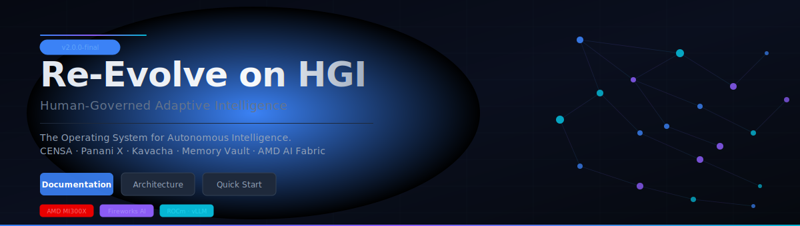

<br/>

[](https://github.com/nextunicorn2026/RE-EVOLVE-ON-HGI-Os/releases)
[](LICENSE)
[](https://www.amd.com/en/developer.html)
[](https://fireworks.ai)
[](https://nestjs.com)
[](https://nextjs.org)
[](https://www.postgresql.org)
[](https://qdrant.tech)
[](https://www.typescriptlang.org)
[](docs/HACKATHON.md)

<br/>

**[Documentation](docs/)** · **[Architecture](#-section-02--os-overview--architecture)** · **[Quick Start](#-section-07--developer-journey)** · **[Demo](JUDGE_SCRIPT.md)** · **[Collaboration](docs/COLLABORATION.md)** · **[Open Letter](docs/OPEN_LETTER_TO_AMD.md)**

</div>

---

## 🧠 Section 02 — OS Overview & Architecture

Re-Evolve on HGI is a production-grade **AI Agent Operating System** — not an assistant, not a framework, but a complete intelligence coordination platform. It translates abstract human goals into governed, sandboxed, explainable multi-agent execution pipelines, with persistent semantic memory and real-time hardware routing to AMD AI Fabric. Every layer of the stack has a defined role, a clear contract, and a verifiable audit trail.

<br/>

<div align="center">
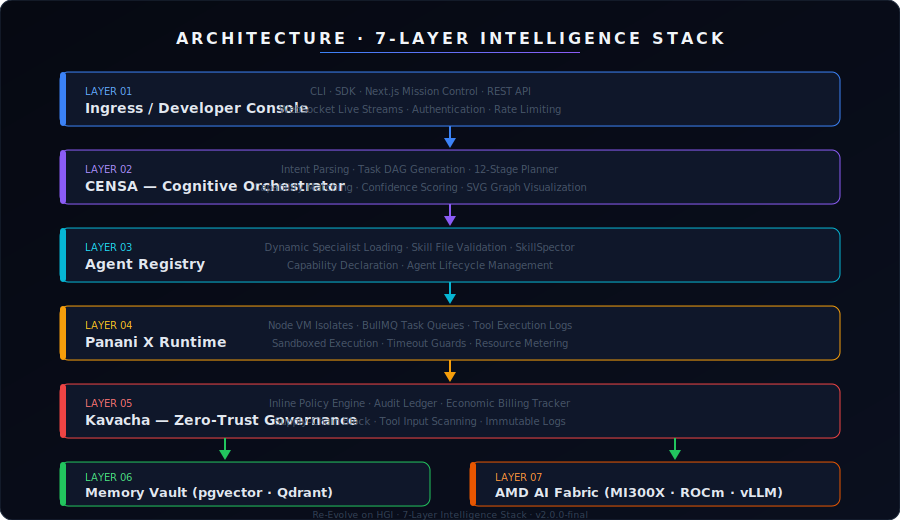
</div>

<br/>

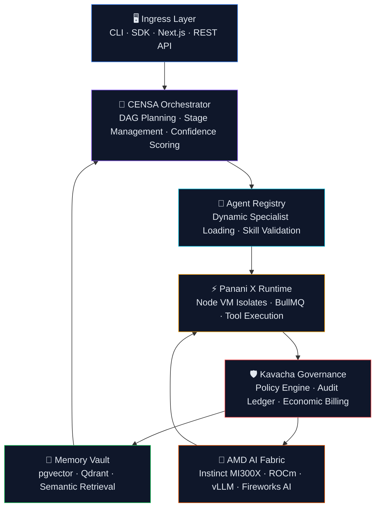

---

## ⚡ Section 03 — The Intelligence Stack

<div align="center">

| Component | Role | Technology |
|-----------|------|------------|
| **CENSA** | Cognitive Orchestrator — parses goals, generates Task DAGs, manages 12-stage execution timelines | NestJS · TypeScript · SVG Visualization |
| **Panani X** | Sandboxed Task Runtime — executes agent tools inside Node VM isolates with timeout guards | Node.js `vm` · BullMQ · Redis |
| **Kavacha** | Zero-Trust Governance — scans tool inputs inline, blocks supply-chain threats, maintains audit ledger | Policy Engine · Prisma · PostgreSQL |
| **Memory Vault** | Persistent Semantic Memory — multi-tiered episodic + semantic retrieval across sessions | pgvector · Qdrant · PostgreSQL |
| **Agent Galaxy** | Specialist Swarm — dynamically loaded agents matched to task capabilities | Agent Registry · SkillSpector · TypeScript |
| **Enterprise APIs** | REST + WebSocket endpoints with auth, rate limiting, and live event streaming | NestJS · Passport · WebSockets |
| **AMD AI Fabric** | Hardware Routing Layer — LiteLLM/vLLM failover to AMD Instinct MI300X clusters in <500ms | ROCm · vLLM · LiteLLM · Fireworks AI |

</div>

<br/>

<details>
<summary><strong>📐 CENSA — Cognitive Execution &amp; Neural Synthesis Agent</strong></summary>
<br/>
<div align="center">
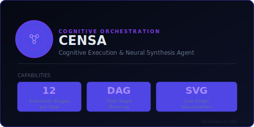
</div>

CENSA is the central nervous system of Re-Evolve. It accepts a natural language goal, infers user intent using the configured LLM, and generates a 12-stage execution Directed Acyclic Graph. At each stage, CENSA matches required capabilities to available specialists in the Agent Registry, evaluates confidence scores, and produces a live SVG visualization of the current system state.

**Responsibilities:**
- Goal parsing and intent inference
- Task DAG generation with dependency resolution
- Agent capability matching
- Confidence scoring at each stage
- Live SVG execution graph rendering
- Stage retry logic and failure escalation

</details>

<details>
<summary><strong>⚡ Panani X — Sandboxed Task Runtime</strong></summary>
<br/>
<div align="center">
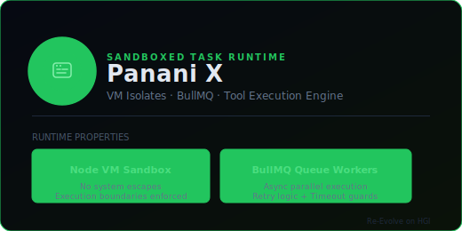
</div>

Panani X executes every tool call inside a Node.js `vm` sandbox. Tools cannot access the host file system, make unauthorized network requests, or escape their defined execution boundary. BullMQ workers manage async task queues with retry logic, timeout guards, and resource metering.

**Responsibilities:**
- Node VM sandbox isolation per tool execution
- BullMQ async job queue management
- Execution timeout enforcement
- Tool output logging and streaming
- Resource usage metering

</details>

<details>
<summary><strong>🛡️ Kavacha — Zero-Trust Governance Engine</strong></summary>
<br/>
<div align="center">
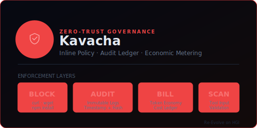
</div>

Kavacha evaluates every tool call before it executes. Inline policies block known supply-chain threats (curl, wget, unverified npm install), validate tool input parameters, and log every decision to an immutable audit trail. An economic billing ledger tracks token spend per agent per session.

**Responsibilities:**
- Pre-execution inline policy scanning
- Supply-chain threat blocking
- Immutable audit log creation
- Economic billing ledger management
- Policy rule authoring interface

</details>

<details>
<summary><strong>💾 Memory Vault — Persistent Semantic Memory</strong></summary>
<br/>
<div align="center">
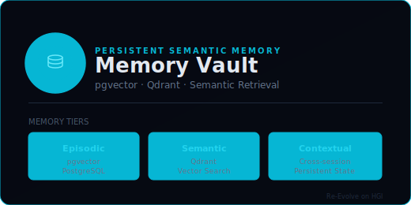
</div>

Memory Vault provides three-tier persistent memory. Episodic memory stores interaction histories in PostgreSQL with pgvector for vector similarity search. Semantic memory indexes knowledge in Qdrant for fast approximate nearest-neighbor retrieval. Contextual memory maintains cross-session organizational state.

**Responsibilities:**
- Episodic memory storage and retrieval (pgvector)
- Semantic vector search (Qdrant)
- Cross-session context persistence
- Memory relevance scoring and pruning
- Agent memory namespace isolation

</details>

---

## 🔄 Section 04 — Interactive System Flow

<div align="center">
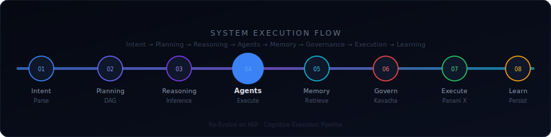
</div>

<br/>

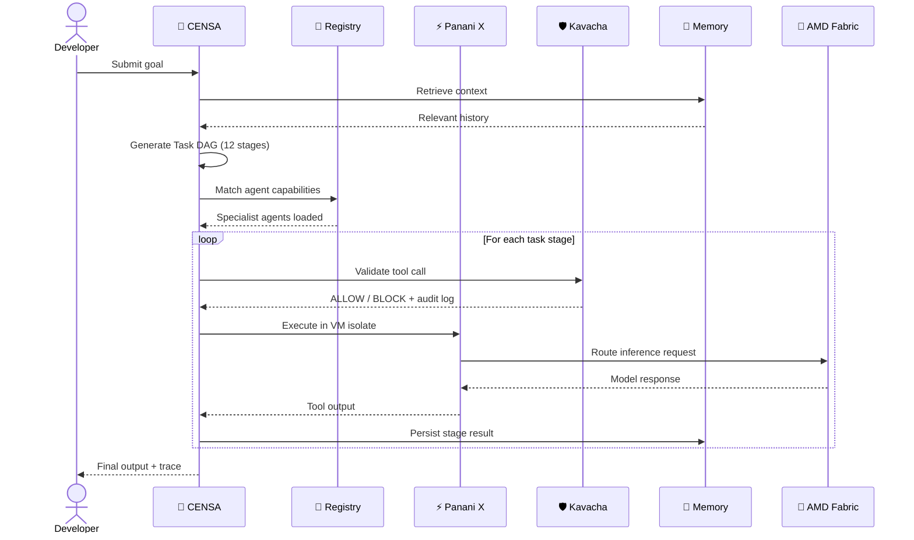

---

## 🛠️ Section 05 — Technology Ecosystem

<div align="center">

### Core Infrastructure

| Layer | Technology | Purpose |
|-------|-----------|---------|
| Runtime | Node.js 20 LTS | Backend execution environment |
| Framework | NestJS 10 | Modular backend architecture |
| Language | TypeScript 5 | Type-safe development |
| Frontend | Next.js 14 | Mission Control dashboard |
| Queue | BullMQ + Redis | Async task worker management |
| ORM | Prisma | PostgreSQL schema management |
| Auth | Passport + JWT | Multi-tenant authentication |

### AI & Inference

| Provider | Use Case | Integration |
|---------|---------|------------|
| AMD AI Developer Cloud | Primary inference on Instinct MI300X | LiteLLM + vLLM |
| Fireworks AI | Hosted LLM inference fallback | REST API |
| vLLM | Local ROCm-accelerated serving | OpenAI-compatible endpoint |
| LiteLLM | Multi-provider load balancing & failover | Proxy layer |

### Data & Memory

| Component | Technology | Purpose |
|-----------|-----------|---------|
| Relational DB | PostgreSQL 16 | Primary data store |
| Vector Search | pgvector | Episodic memory embeddings |
| Vector DB | Qdrant | Semantic memory indices |
| Cache | Redis 7 | Queue state + session cache |

### Monitoring & Operations

| Tool | Purpose |
|------|---------|
| Prisma Studio | Schema browsing |
| BullMQ Dashboard | Queue monitoring |
| Custom Trace Dashboard | Judge Mode 12-stage live view |
| pxpipe | Token compression (-68% on dense contexts) |

</div>

---

## 🌌 Section 06 — Repository Universe

<div align="center">
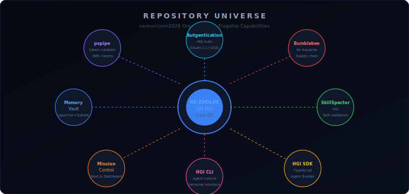
</div>

<br/>

| Repository | Role | Integration Point |
|------------|------|-----------------|
| **RE-EVOLVE-ON-HGI-Os** | Core OS — CENSA, Panani X, Kavacha, Memory Vault | Central hub |
| **pxpipe-token-cutdown-** | Text-to-PNG token compressor (-68% tokens) | CENSA prompt pipeline |
| **Autgentication-HGI** | Multi-tenant OAuth 2.1 / OIDC auth | Ingress layer |
| **Bumblebee-for-Kavacha-** | Supply-chain dependency scanner | Kavacha pre-scan |
| **SkillSpector-HGI** | Static agent skill file validator | Agent Registry |
| **Mission Control** | Next.js dashboard — live trace, judge mode | Developer Console |
| **HGI SDK** | TypeScript agent builder SDK | Developer Ingress |
| **HGI CLI** | Terminal agent control interface | Developer Ingress |

---

## 🚀 Section 07 — Developer Journey

<div align="center">
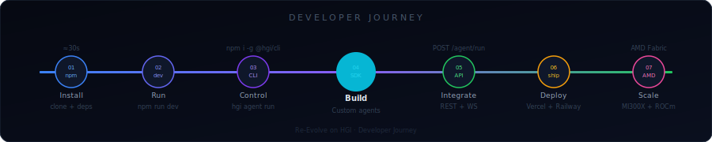
</div>

<br/>

### Step 1 — Install (30 seconds)

```bash
git clone https://github.com/nextunicorn2026/RE-EVOLVE-ON-HGI-Os
cd RE-EVOLVE-ON-HGI-Os
cp .env.example .env     # Add your API keys
```

### Step 2 — Run Backend

```bash
cd backend
npm install
npx prisma migrate dev --name init
npm run start:dev
# ✓ NestJS running at http://localhost:3001
```

### Step 3 — Run Frontend

```bash
cd frontend
npm install
npm run dev
# ✓ Mission Control at http://localhost:3000
```

### Step 4 — Submit Your First Goal

```bash
curl -X POST http://localhost:3001/agent/run \
  -H "Content-Type: application/json" \
  -d '{"goal": "Analyze this codebase and identify security vulnerabilities"}'
```

### Step 5 — CLI (Optional)

```bash
npm install -g @hgi/cli
hgi agent list
hgi agent run --goal "Write a technical report on quantum computing"
hgi memory search --query "previous security audits"
```

### Step 6 — SDK (Build Custom Agents)

```typescript
import { HGIClient, Agent } from '@hgi/sdk';

const client = new HGIClient({ apiKey: process.env.HGI_API_KEY });

const result = await client.agents.run({
  goal: 'Summarize and classify these support tickets',
  context: { tickets: data },
  governance: { maxTokens: 8000, blockList: ['curl', 'wget'] }
});
```

### Step 7 — Scale on AMD

```yaml
# docker-compose.amd.yml
services:
  inference:
    image: vllm/vllm-openai:latest
    devices:
      - /dev/kfd
      - /dev/dri
    environment:
      - HIP_VISIBLE_DEVICES=0,1,2,3
```

---

## 🏢 Section 08 — Enterprise Use Cases

<div align="center">

| Industry | Agent Swarm Scenario | Governance Requirement |
|---------|---------------------|----------------------|
| **Healthcare** | Clinical decision support, patient record summarization, diagnostic literature review | HIPAA audit trails, PII redaction, model explainability |
| **Finance** | Portfolio analysis, regulatory filing review, fraud pattern detection | SOC 2 compliance, immutable decision logs, bias auditing |
| **Manufacturing** | Predictive maintenance, supply chain optimization, safety incident analysis | OT/IT boundary policies, operational tool sandboxing |
| **Government** | Policy document analysis, citizen query routing, inter-agency coordination | Data sovereignty, classification-level filtering, FOIA compliance |
| **Research** | Literature synthesis, hypothesis generation, experiment design assistance | Source attribution, reproducibility logs, citation tracking |
| **Retail** | Demand forecasting, customer journey analysis, inventory management | PCI DSS tooling boundaries, customer data isolation |
| **Automotive** | Fleet telemetry analysis, recall pattern detection, maintenance scheduling | Safety-critical action blocking, hardware boundary enforcement |

</div>

---

## 🔴 Section 09 — AMD Developer Cloud Integration

<div align="center">

```
┌──────────────────────────────────────────────────────────────────┐
│                    AMD AI Integration Layer                       │
│                                                                  │
│   ┌──────────────┐    ┌──────────────┐    ┌──────────────────┐  │
│   │  AMD Instinct │    │  ROCm Stack  │    │  Fireworks AI    │  │
│   │  MI300X       │    │  vLLM Serve  │    │  Inference API   │  │
│   │  Clusters     │    │  PyTorch HIP │    │  Hosted Models   │  │
│   └──────┬───────┘    └──────┬───────┘    └────────┬─────────┘  │
│          └─────────────────────────────────────────┘            │
│                         LiteLLM Proxy                            │
│              Unified OpenAI-Compatible Endpoint                  │
│              Auto-failover in < 500ms                            │
└──────────────────────────────────────────────────────────────────┘
                              │
                    Re-Evolve HGI Core OS
              CENSA → Panani X → Kavacha → Memory
```

</div>

**How Re-Evolve leverages AMD infrastructure:**

- **Primary Inference**: LiteLLM routes requests to AMD Instinct MI300X clusters via vLLM's OpenAI-compatible endpoint. ROCm-accelerated PyTorch serves the underlying models.
- **Failover Routing**: If the primary AMD endpoint returns elevated latency or errors, LiteLLM automatically shifts traffic to Fireworks AI-hosted inference in under 500ms. No agent workflow is interrupted.
- **Token Optimization**: pxpipe compresses dense prompt contexts into PNG representations before sending to inference, reducing input token usage by ~68% on complex analytical tasks.
- **Agentic Workloads**: Multi-stage CENSA execution plans generate dozens of sequential LLM calls per goal. AMD MI300X throughput characteristics are well-suited to this sustained, parallel inference pattern.
- **Benchmarking Opportunity**: We measure end-to-end latency per CENSA stage, per inference call, and per tool execution — producing structured data suitable for hardware-level performance analysis.

---

## 📅 Section 10 — Roadmap

<div align="center">
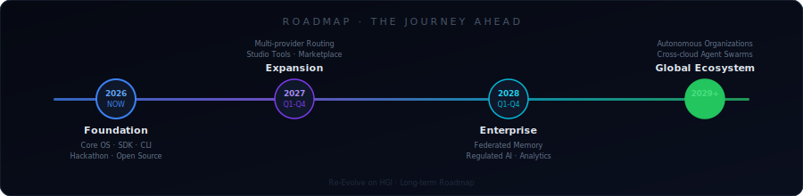
</div>

<br/>

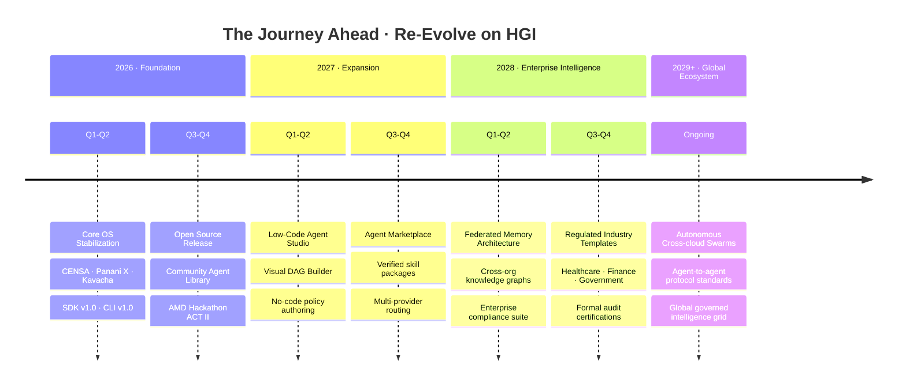

---

## 🤝 Section 11 — Open Source & Community

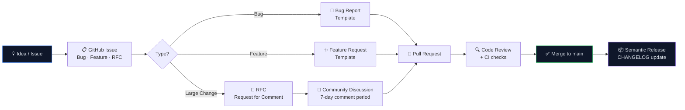

**How to contribute:**

```bash
# 1. Fork and clone
git clone https://github.com/YOUR_USERNAME/RE-EVOLVE-ON-HGI-Os

# 2. Create a feature branch
git checkout -b feat/your-feature-name

# 3. Develop with tests
npm run test

# 4. Commit using Conventional Commits
git commit -m "feat(censa): add parallel stage execution"

# 5. Open a Pull Request against main
```

See [CONTRIBUTING.md](CONTRIBUTING.md) for detailed guidelines, coding standards, and the RFC process.

---

## 👤 Section 12 — Founder Vision

<div align="center">

*From Aryan, Founder of Re-Evolve on HGI*

</div>

---

I started Re-Evolve because I kept asking a question that existing tools couldn't answer:

**If AI systems are becoming genuinely capable, why do they still forget everything the moment a session ends? Why do they work alone? Why can't I see what they're doing or why?**

The answers pointed to the same gap: there is no operating system for intelligence.

There are models. There are frameworks. There are chat interfaces. But there is no layer that sits between the raw capability of a language model and the coordinated, governed, explainable behavior that real-world applications require.

That is what Re-Evolve is. Not a better chatbot. Not a smarter framework. An operating system — with a planner, a runtime, a security layer, a memory system, and a hardware routing layer — that makes autonomous agents behave like disciplined, auditable, production-grade systems rather than probabilistic black boxes.

I believe the future of AI is not defined by any single model or company. It is defined by the infrastructure we build together — infrastructure that allows many agents, with many capabilities, built by many developers, to work together safely and responsibly.

That infrastructure should be open. It should be explainable. It should be governed.

Re-Evolve on HGI is my contribution to that infrastructure. It is not finished. It may never be. But it is honest — every claim backed by code, every architectural decision documented, every limitation acknowledged.

If you are building something in this space, I would genuinely love to compare notes. Not as a sales conversation. As one builder to another.

The problems are hard enough. We should work on them together.

— *Aryan, Founder, Re-Evolve on HGI*

---

Read the full open letter: **[An Open Letter to the AMD AI Team →](docs/OPEN_LETTER_TO_AMD.md)**

---

## 🔗 Section 13 — Quick Links

<div align="center">

| Resource | Description |
|----------|-------------|
| **[README](README.md)** | This document |
| **[Architecture](ARCHITECTURE.md)** | Deep-dive technical architecture |
| **[CENSA](CENSA.md)** | Cognitive orchestrator internals |
| **[Panani X](PANANI_X.md)** | Runtime execution engine |
| **[Kavacha](KAVACHA.md)** | Governance engine |
| **[SDK Reference](SDK.md)** | TypeScript SDK documentation |
| **[CLI Reference](CLI.md)** | Command-line interface |
| **[API Reference](API.md)** | REST + WebSocket API |
| **[Quick Start](QUICKSTART.md)** | 5-minute setup guide |
| **[Demo Script](JUDGE_SCRIPT.md)** | Hackathon judge demo walkthrough |
| **[Roadmap](docs/ROADMAP.md)** | The Journey Ahead |
| **[Collaboration](docs/COLLABORATION.md)** | Builder-to-builder invitation |
| **[Open Letter](docs/OPEN_LETTER_TO_AMD.md)** | Letter to the AMD AI Team |
| **[Hackathon](HACKATHON.md)** | AMD ACT II submission overview |
| **[Changelog](CHANGELOG.md)** | Version history |
| **[Contributing](CONTRIBUTING.md)** | Contribution guide |
| **[Security](SECURITY_REPORT.md)** | Security posture report |

</div>

---

## 🏁 Section 14 — Footer

<div align="center">

<br/>

**Re-Evolve on HGI** · Human-Governed Adaptive Intelligence Operating System

Built for the AMD Developer Hackathon ACT II · v2.0.0-final

<br/>

[](https://www.amd.com/en/developer.html)
[](https://fireworks.ai)
[](LICENSE)
[](CONTRIBUTING.md)

<br/>

*"Whether or not our paths cross after this hackathon, thank you for creating opportunities that encourage developers around the world to imagine, build, and share ambitious ideas."*

— Aryan, Founder

<br/>

[nextunicorn2026](https://github.com/nextunicorn2026) · [MIT License](LICENSE) · [Code of Conduct](CODE_OF_CONDUCT.md)

</div>
