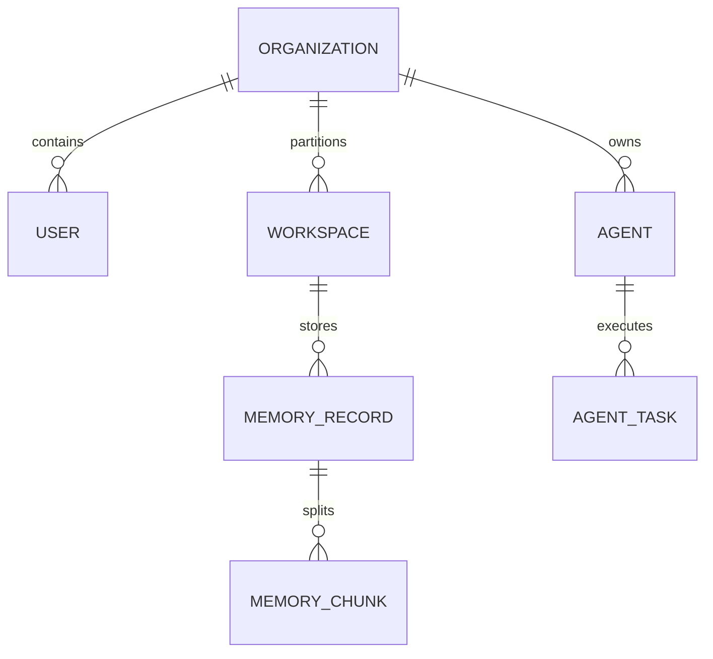

# Re-Evolve V3 — Database Design (Project Singularity)

This document specifies the database architecture, partition schemes, and vector indexing structures for **Re-Evolve V3**.

---

## 1. Database Schema Scope

V3 database is hosted on **PostgreSQL 16** with extensions enabled:
*   `pgvector`: Vector embedding indexes.
*   `pg_trgm`: Fast text query searches.
*   `uuid-ossp`: Secure ID generation.

The relational and vector database models are declared in [schema.prisma](file:///Users/nextunicorn/.gemini/antigravity-ide/scratch/re-evolve-v3/backend/prisma/schema.prisma).



---

## 2. Multi-Tenant Scoping

All tables representing business intelligence, logs, and assets are partitioned or scoped by `orgId` (Organization reference) and `workspaceId` (Workspace reference) to guarantee tenant isolation at the query level.

### Scoping Rules:
1.  **Row-Level Security (RLS)**: Enforced via PostgreSQL policies matching the connection context `current_setting('app.current_org_id')`.
2.  **Scoped Composite Indexes**: High-volume tables must prefix query indexes with `[orgId, createdAt]`.
3.  **Core Reference**: Detailed in the Layer 1 security section of [system_architecture.md](file:///Users/nextunicorn/.gemini/antigravity-ide/scratch/re-evolve-v3/docs/architecture/system_architecture.md#layer-1-identity--workspace-os).

---

## 3. Vector Embeddings Schema

We use `pgvector` for memory storage.
Embeddings are mapped to 1536 dimensions, corresponding to OpenAI's `text-embedding-3-large` or Google's `text-embedding-gecko` models.

The primary database representation is specified in [schema.prisma](file:///Users/nextunicorn/.gemini/antigravity-ide/scratch/re-evolve-v3/backend/prisma/schema.prisma) and managed by the [memory module](file:///Users/nextunicorn/.gemini/antigravity-ide/scratch/re-evolve-v3/backend/src/modules/memory).

```prisma
model MemoryRecord {
  id          String   @id @default(uuid())
  orgId       String
  kind        MemoryKind
  content     String
  summary     String?
  // pgvector extension column
  embedding   Unsupported("vector(1536)")?
  vectorRef   String?                          
  retention   RetentionTier @default(WARM)
  createdAt   DateTime @default(now())
}
```

### HNSW Index Configuration
To ensure sub-millisecond retrieval speeds at 1,000,000+ records, we use **HNSW** (Hierarchical Navigable Small World) index over cosine distance instead of IVFFlat:

```sql
CREATE INDEX memory_hnsw_idx ON memory_records 
USING hnsw (embedding vector_cosine_ops) 
WITH (m = 16, ef_construction = 64);
```

---

## 4. Telemetry Partitioning & High-Volume Indexing

The telemetry grid ingests millions of events daily.
We partition the `telemetry_events` and `api_traffic` tables by month (`RANGE (ts)`). These events are captured asynchronously via the Kafka pipeline mapped in [service_architecture.md](file:///Users/nextunicorn/.gemini/antigravity-ide/scratch/re-evolve-v3/docs/architecture/service_architecture.md#3-event-backbone-catalog-kafka).

```sql
CREATE TABLE telemetry_events (
    id UUID NOT NULL DEFAULT uuid_generate_v4(),
    org_id VARCHAR(255) NOT NULL,
    service VARCHAR(255) NOT NULL,
    kind VARCHAR(50) NOT NULL,
    payload JSONB NOT NULL,
    ts TIMESTAMP WITH TIME ZONE NOT NULL,
    PRIMARY KEY (id, ts)
) PARTITION BY RANGE (ts);
```

### Optimization Indexes
*   `idx_telemetry_query`: `CREATE INDEX idx_telemetry_query ON telemetry_events (org_id, ts DESC);`
*   `idx_traffic_status`: `CREATE INDEX idx_traffic_status ON api_traffic (statusCode, ts DESC);`

---

## 5. Migration Strategy
For details on migrating standard transactional and memory records from V2 stable schemas to the partitioned V3 system, refer to the [ultra_tier_rollout.md](file:///Users/nextunicorn/.gemini/antigravity-ide/scratch/re-evolve-v3/docs/architecture/ultra_tier_rollout.md#1-zero-downtime-data-migration-from-v2) playbook.
