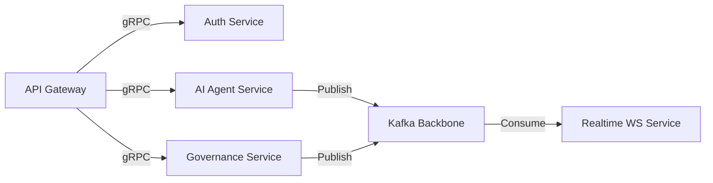

# Re-Evolve V3 — Service Architecture (Project Singularity)

This document specifies the internal service mesh, gRPC protocols, event backbones, and runtime safety policies of **Re-Evolve V3**.

---

## 1. Microservice Domain Breakdown

V3 operates as a containerized service mesh communicating internally via high-speed **gRPC** and asynchronously via **Kafka**.



### Services Catalog & Core Modules:
1.  **API Gateway**: Exposes GraphQL, REST (Swagger), and routes inbound connections. Refer to [api_contracts.md](file:///Users/nextunicorn/.gemini/antigravity-ide/scratch/re-evolve-v3/docs/architecture/api_contracts.md).
2.  **Auth Service**: Handles token verifications, tenant isolation context, and ABAC policies.
3.  **AI Agent Service**: Plans and executes agent workflows using LangGraph and BullMQ. Implemented in [backend/src/modules/agents/](file:///Users/nextunicorn/.gemini/antigravity-ide/scratch/re-evolve-v3/backend/src/modules/agents).
4.  **Governance Service**: Evaluates Kavacha policies, checks risk parameters, and registers audit logs. Implemented in [backend/src/modules/governance/](file:///Users/nextunicorn/.gemini/antigravity-ide/scratch/re-evolve-v3/backend/src/modules/governance).
5.  **Realtime Service**: Manages state broadcasts to clients via socket channels.
6.  **Orchestration Service**: Computes task DAG routing and matches task stages to qualified agents. Implemented in [backend/src/modules/workflows/](file:///Users/nextunicorn/.gemini/antigravity-ide/scratch/re-evolve-v3/backend/src/modules/workflows).

---

## 2. Internal Communication Protocol (gRPC)

All internal synchronous communication is handled using gRPC over HTTP/2. Below is the proto definition for the **HGI Brain Core**:

```proto
syntax = "proto3";

package hgi;

service BrainService {
  rpc RouteIntent (IntentRequest) returns (IntentResponse);
  rpc ValidateCompliance (KavachaRequest) returns (KavachaResponse);
}

message IntentRequest {
  string org_id = 1;
  string workspace_id = 2;
  string prompt = 3;
  string session_token = 4;
}

message IntentResponse {
  string goal = 1;
  string provider = 2;
  double confidence = 3;
  repeated string agent_ids = 4;
}

message KavachaRequest {
  string actor = 1;
  string action = 2;
  string payload = 3;
  int32 risk_level = 4;
}

message KavachaResponse {
  bool allowed = 1;
  string restriction_code = 2;
  string audit_log_id = 3;
}
```

---

## 3. Event Backbone Catalog (Kafka)

Kafka operates as the nervous system for asynchronous workflows. Prometheus metrics alerts are configured to monitor this queue as outlined in [production_readiness.md](file:///Users/nextunicorn/.gemini/antigravity-ide/scratch/re-evolve-v3/docs/architecture/production_readiness.md#4-prometheus-alert-rules-configuration).

| Topic Name | Producer Service | Consumer Service | Payload Contract |
|---|---|---|---|
| `agent.task.created` | Orchestrator | Agent Runtime | `{ taskId: UUID, agentId: UUID, input: JSON }` |
| `agent.task.completed` | Agent Runtime | Telemetry, WS | `{ taskId: UUID, latencyMs: Int, success: Bool }` |
| `governance.violation` | Gov Policy | WS, AuditLog | `{ policyId: UUID, severity: Enum, detail: JSON }` |
| `economy.transaction` | Billing | WS, Analytics | `{ amountCents: Long, kind: String, direction: Enum }` |
| `telemetry.anomaly` | Telemetry | Gov Policy, WS | `{ service: String, metric: String, value: Float }` |

---

## 4. Kavacha Shield Runtime Protection Policies

The **Kavacha Shield** acts as a policy firewall. It intercepts agent actions *before* execution to guarantee compliance and prevent budget leakage. The implementation logic is located in [backend/src/modules/governance/](file:///Users/nextunicorn/.gemini/antigravity-ide/scratch/re-evolve-v3/backend/src/modules/governance).

```ts
export function validateExecution(action: { type: string; costCents: number; riskScore: number }) {
  // 1. Ethics/Compliance gate
  if (action.riskScore > 90) {
    throw new Error('Kavacha Shield: Action blocked due to extreme security risk');
  }

  // 2. Budgetary leakage gate
  if (action.costCents > 50000) { // $500 limit
    throw new Error('Kavacha Shield: Transaction limit exceeded. Requires manual approval');
  }

  return true;
}
```
