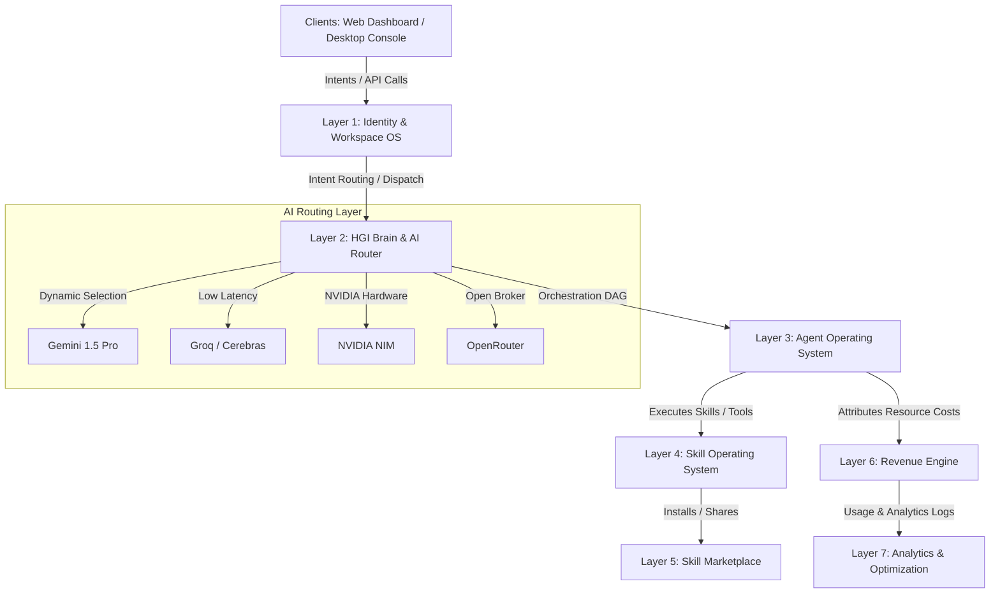

# Re-Evolve V3 — System Architecture (Project Singularity)

This document specifies the structural architecture of the **Re-Evolve V3** AI Business Operating System.



---

## 1. Core Topologies (The 7-Layer Stack)

### Layer 1: Identity & Workspace OS
*   **Purpose**: Manages multi-tenant isolation, organization setups (Personal, Startup, Agency, Enterprise, Investment), and RBAC/ABAC session parameters.
*   **Security**: Encapsulated by token guards and the **Kavacha Shield** interceptor layer.
*   **Reference Documents**:
    *   [feature_flag_strategy.md](file:///Users/nextunicorn/.gemini/antigravity-ide/scratch/re-evolve-v3/docs/architecture/feature_flag_strategy.md): Controls feature availability based on user tier.
    *   [ultra_tier_rollout.md](file:///Users/nextunicorn/.gemini/antigravity-ide/scratch/re-evolve-v3/docs/architecture/ultra_tier_rollout.md): Restricts access to selected strategic cohorts.
*   **Target Codebase Paths**:
    *   [security](file:///Users/nextunicorn/.gemini/antigravity-ide/scratch/re-evolve-v3/frontend/app/hq/security): Frontend security console.
    *   [settings](file:///Users/nextunicorn/.gemini/antigravity-ide/scratch/re-evolve-v3/frontend/app/hq/settings): Workspace tenant configurations.

### Layer 2: HGI Brain & AI Router
*   **Purpose**: The central nervous system of V3. Resolves user intents, plans multi-agent workflows (concentric graph topology), and dynamically routes LLM queries to the most cost-effective and low-latency providers.
*   **Reference Documents**:
    *   [api_contracts.md](file:///Users/nextunicorn/.gemini/antigravity-ide/scratch/re-evolve-v3/docs/architecture/api_contracts.md): Specs for `/agents/dispatch` intent routes.
*   **Target Codebase Paths**:
    *   [neural-core](file:///Users/nextunicorn/.gemini/antigravity-ide/scratch/re-evolve-v3/frontend/app/hq/neural-core): Dashboard telemetry for intent routing.

### Layer 3: Agent Operating System
*   **Purpose**: Orchestrates the HGI agent workforce. Implements distributed BullMQ queues and Kafka telemetry networks to govern agent lifecycles, states, and cross-agent communication.
*   **Reference Documents**:
    *   [service_architecture.md](file:///Users/nextunicorn/.gemini/antigravity-ide/scratch/re-evolve-v3/docs/architecture/service_architecture.md): Specifies the Kafka event backbone.
*   **Target Codebase Paths**:
    *   [workflows](file:///Users/nextunicorn/.gemini/antigravity-ide/scratch/re-evolve-v3/backend/src/modules/workflows): Workflow orchestration and DAG parsing.
    *   [agents (backend)](file:///Users/nextunicorn/.gemini/antigravity-ide/scratch/re-evolve-v3/backend/src/modules/agents): Active agent processes.
    *   [agents (frontend)](file:///Users/nextunicorn/.gemini/antigravity-ide/scratch/re-evolve-v3/frontend/app/hq/agents): Agent fleet manager dashboard.
    *   [sarathi](file:///Users/nextunicorn/.gemini/antigravity-ide/scratch/re-evolve-v3/frontend/app/hq/sarathi): Visual orchestration canvas.

### Layer 4: Skill Operating System
*   **Purpose**: Executes atomic skills (e.g., Code Gen, PDF Parsing, API Integration) via sandbox environments. Enforces policy limits at runtime.
*   **Reference Documents**:
    *   [database_design.md](file:///Users/nextunicorn/.gemini/antigravity-ide/scratch/re-evolve-v3/docs/architecture/database_design.md): Describes pgvector schema for skill code embeddings.
*   **Target Codebase Paths**:
    *   [memory](file:///Users/nextunicorn/.gemini/antigravity-ide/scratch/re-evolve-v3/backend/src/modules/memory): Vector memory retrieval layer.

### Layer 5: Skill Marketplace
*   **Purpose**: Allows users to discover, purchase, and monetize reusable agent skills, workflow templates, and knowledge packs.
*   **Target Codebase Paths**:
    *   [ecosystem](file:///Users/nextunicorn/.gemini/antigravity-ide/scratch/re-evolve-v3/frontend/app/hq/ecosystem): Skill marketplace storefront.

### Layer 6: Revenue Engine
*   **Purpose**: Tracks billing data, subscription tiers, API resource consumption, and transaction royalties.
*   **Target Codebase Paths**:
    *   [finance](file:///Users/nextunicorn/.gemini/antigravity-ide/scratch/re-evolve-v3/frontend/app/hq/finance): Financial balance and ledgers display.

### Layer 7: Analytics & Optimization
*   **Purpose**: Aggregates telemetry metrics, governance logs, and financial flows to continuously improve model parameters.
*   **Reference Documents**:
    *   [production_readiness.md](file:///Users/nextunicorn/.gemini/antigravity-ide/scratch/re-evolve-v3/docs/architecture/production_readiness.md): Specifies Prometheus rules and SLO targets.
*   **Target Codebase Paths**:
    *   [telemetry](file:///Users/nextunicorn/.gemini/antigravity-ide/scratch/re-evolve-v3/backend/src/modules/telemetry): Metrics parser.
    *   [simulation](file:///Users/nextunicorn/.gemini/antigravity-ide/scratch/re-evolve-v3/backend/src/modules/simulation): Real-time metrics simulation engine.

---

## 2. Intent Routing & AI Provider Routing Flow

V3 does not use hardcoded LLM endpoints. All intent calls are routed dynamically based on a score calculated in real-time.

```
User Input Intent
  │
  ▼
Intent Router (Detects Domain: e.g., Finance, Code, Creative)
  │
  ▼
AI Provider Scoring Engine
  ├── Cost score (weight: 0.3)
  ├── Latency score (weight: 0.3)
  ├── Quality score (weight: 0.4)
  ▼
Best Provider Selection (e.g., Cerebras for speed, Gemini for large context)
  │
  ▼
Kavacha Guard Verification (Validates safety & compliance)
  │
  ▼
LLM Call Execution & telemetries recorded back to Analytics
```

### Provider Scoring Formula
$$Score = (w_{cost} \cdot S_{cost}) + (w_{latency} \cdot S_{latency}) + (w_{quality} \cdot S_{quality})$$

*   **Gemini**: Selected for massive context reasoning and multi-modal analyses.
*   **Groq / Cerebras**: Selected for real-time chat replies and low-latency execution steps.
*   **NVIDIA NIM**: Selected for offline local inference and custom fine-tuned weights.
